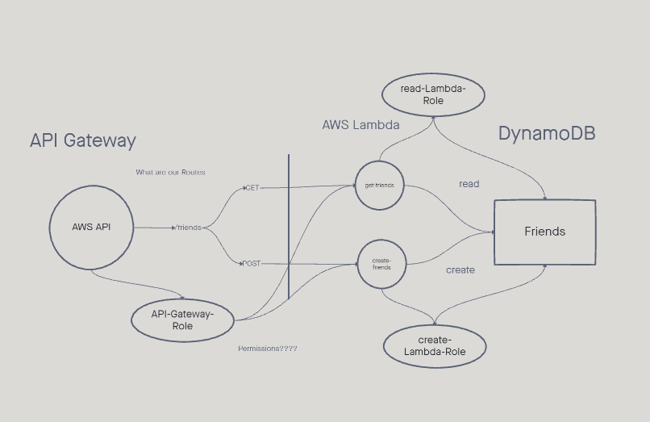

# Serverless-API  

# UML
  
Ref: Instructor Demo 

### Routes and Functions  

What is the root URL to your API?  
https://mm8qa5db1e.execute-api.us-west-2.amazonaws.com/Production 

What are the routes?  
- GET  
- POST 
- DELETE
- PUT

What inputs do they require? 
- GET  
- POST 
- DELETE
- PUT

What output do they return?  
- GET  - SQL table
- POST - Random Id # between 0-100  
- DELETE
- PUT   - 